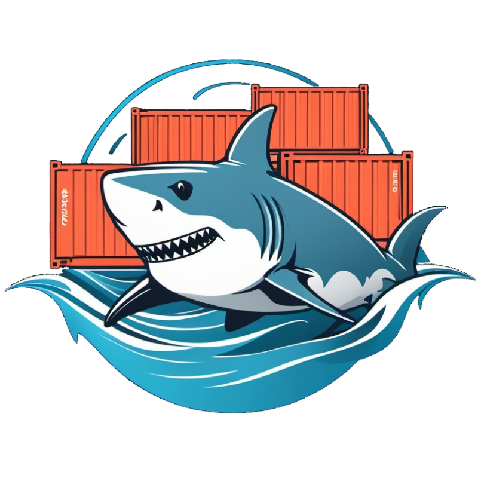

<!-- trunk-ignore-all(markdownlint/MD041) -->

# [Ebizbase Development Infrastructure](https://github.com/ebizbase/dev-infras)

[![Code Quality][codefactor-shield]][codefactor-url]
[![Issues][issues-shield]][issues-url]
[![Contributors][contributors-shield]][contributors-url]
[![MIT License][license-shield]][license-url]

Development infrastructure projects monorepo. This repo containt prebuilt devcontainer images, devcontainer features, nx plugins.

This project is mainly used internally within ebizbase projects but we have decided to share the entire source code of the project for the community to use and contribute.

## List of packages

### devcontainer features

| Name       | Description|
| ---------- | ---------- | 
| [omz-plugin][omz-plugin-readme] | This feature will install and active plugins for oh my zsh                                      |
| [install-npm-package-globally][install-npm-package-globally-readme] | This feature will be install npm packages globally |
| [powerlevel10k][powerlevel10k-readme] | This feature will install, activate and config powerlevel10k theme for oh my zsh                |
| [npm-playwright][npm-playwright-readme] | This feature will be install playwright via npm with os dependencies and browser binaries               |

### devconainer prebuild images 

| Name       | Description|
| ---------- | ---------- | 
| [base-devcontainer][base-devcontainer-readme]   | The `base-devcontainer` is a prebuild devcontainer image base on debian with common-utils and provide good experiences interacting with the zsh shell        |
| [node-devcontainer][node-devcontainer-readme]   | The image base on `base-devcontainer` with latest NodeJS LTS version (includes npm, pnpm, yarn, bun)        |
| [node-dind-devcontainer][node-dind-devcontainer-readme]   |The image base on `node-devcontainer` with docker in docker |
| [node-dind-playwright-devcontainer][node-dind-playwright-devcontainer-readme]   |The image base on `node-dind-devcontainer` with playwright installed (both OS dependencies and browser binary) |
[node-playwright-devcontainer][node-playwright-devcontainer-readme]   |The image base on `node-devcontainer` with playwright installed (both OS dependencies and browser binary) |

### npm packages
| Name       | Description|
| ---------- | ---------- | 
| [nx-devkit][nx-devkit-readme]  | The NX plugin to build, push and analyze image |

### nx plugins
| Name       | Description|
| ---------- | ---------- | 
| [nx-docker][nx-docker-readme]  | The NX plugin to build and push docker image  
| [nx-dive][nx-dive-readme]  | The NX plugin  exploring a docker image, layer contents, and discovering ways to shrink the size of your Docker/OCI image base on [dive](https://github.com/wagoodman/dive)            

(<a href="#readme-top">back to top</a>)

## Contributing

Contributions are what make the open source community such an amazing place to learn, inspire, and create. Any contributions you make are **greatly appreciated**.

If you have a suggestion that would make this better, please fork the repo and create a pull request. You can also simply open an issue with the tag "enhancement".
Don't forget to give the project a star! Thanks again!

See [Contribution Guidelines][contribution-guidelines-url] for more information.

### Contributors

(<a href="#readme-top">back to top</a>)

## License

Distributed under the MIT License. See [LICENSE][license-url] for more information.

(<a href="#readme-top">back to top</a>)

[codefactor-shield]: https://img.shields.io/codefactor/grade/github/ebizbase/dev-infras
[codefactor-url]: https://www.codefactor.io/repository/github/ebizbase/dev-infras
[contributors-shield]: https://img.shields.io/github/contributors/ebizbase/dev-infras.svg
[contributors-url]: https://github.com/ebizbase/dev-infras/graphs/contributors
[issues-shield]: https://img.shields.io/github/issues/ebizbase/dev-infras.svg
[issues-url]: https://github.com/ebizbase/dev-infras/issues
[license-shield]: https://img.shields.io/github/license/ebizbase/dev-infras.svg
[license-url]: https://github.com/ebizbase/dev-infras/blob/main/LICENSE.txt
[contribution-guidelines-url]: https://github.com/ebizbase/dev-infras/blob/main/CONTRIBUTING.md
[npm-playwright-readme]:https://github.com/ebizbase/dev-infras/blob/main/devcontainer-features/npm-playwright/README.md
[omz-plugin-readme]: https://github.com/ebizbase/dev-infras/blob/main/devcontainer-features/omz-plugin/README.md
[install-npm-package-globally-readme]: https://github.com/ebizbase/dev-infras/blob/main/devcontainer-features/install-npm-package-globally/README.md
[powerlevel10k-readme]: https://github.com/ebizbase/dev-infras/blob/main/devcontainer-features/powerlevel10k/README.md

[base-devcontainer-readme]:https://github.com/ebizbase/dev-infras/blob/main/devcontainer-images/base-devcontainer/README.md
[node-devcontainer-readme]:https://github.com/ebizbase/dev-infras/blob/main/devcontainer-images/node-devcontainer/README.md
[node-dind-devcontainer-readme]:https://github.com/ebizbase/dev-infras/blob/main/devcontainer-images/node-dind-devcontainer/README.md
[node-playwright-devcontainer-readme]:https://github.com/ebizbase/dev-infras/blob/main/devcontainer-images/node-playwright-devcontainer/README.md
[node-dind-playwright-devcontainer-readme]:https://github.com/ebizbase/dev-infras/blob/main/devcontainer-images/node-dind-playwright-devcontainer/README.md

[nx-devkit-readme]: https://github.com/ebizbase/dev-infras/blob/main/packages/nx-devkit/README.md

[nx-docker-readme]: https://github.com/ebizbase/dev-infras/blob/main/packages/nx-docker/README.md
[nx-dive-readme]: https://github.com/ebizbase/dev-infras/blob/main/packages/nx-dive/README.md