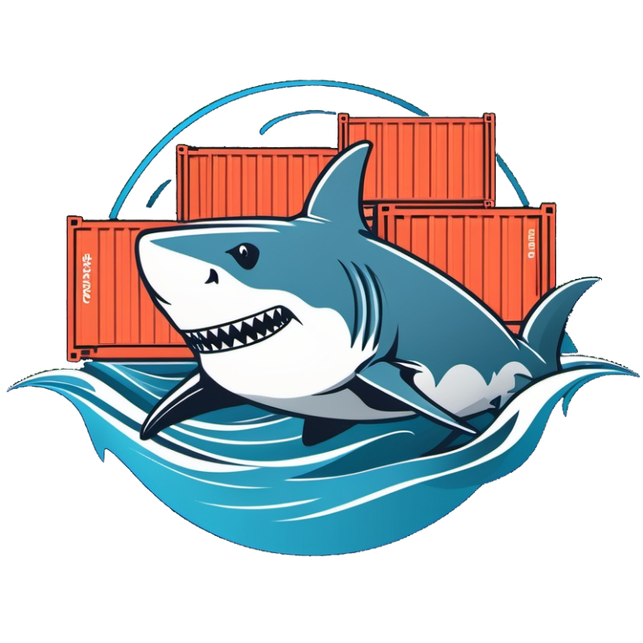

<!-- trunk-ignore-all(markdownlint/MD041) -->

<!-- [![Contributors][contributors-shield]][contributors-url] -->
<!-- [![Forks][forks-shield]][forks-url] -->
<!-- [![Stargazers][stars-shield]][stars-url] -->

[![Issues][codefactor-shield]][codefactor-url]
[![Issues][issues-shield]][issues-url]
[![MIT License][license-shield]][license-url]

 

  

  <h3 align="center">Ebizbase Development Infrastructure</h3>

  

    Development container prebuilt images, development features monorepo!
  

## About The Project

(<a href="#readme-top">back to top</a>)

## Contributing

Contributions are what make the open source community such an amazing place to learn, inspire, and create. Any contributions you make are **greatly appreciated**.

If you have a suggestion that would make this better, please fork the repo and create a pull request. You can also simply open an issue with the tag "enhancement".
Don't forget to give the project a star! Thanks again!

See [Contribution Guidelines][contribution-guidelines-url] for more information.

### Contributors

(<a href="#readme-top">back to top</a>)

## License

Distributed under the MIT License. See [LICENSE][license-url] for more information.

(<a href="#readme-top">back to top</a>)

[codefactor-shield]: https://img.shields.io/codefactor/grade/github/ebizbase/dev-infras?style=for-the-badge
[codefactor-url]: https://www.codefactor.io/repository/github/ebizbase/dev-infras

<!-- [contributors-shield]: https://img.shields.io/github/contributors/ebizbase/dev-infras.svg?style=for-the-badge
[contributors-url]: https://github.com/ebizbase/dev-infras/graphs/contributors
[forks-shield]: https://img.shields.io/github/forks/ebizbase/dev-infras.svg?style=for-the-badge
[forks-url]: https://github.com/ebizbase/dev-infras/network/members
[stars-shield]: https://img.shields.io/github/stars/ebizbase/dev-infras.svg?style=for-the-badge
[stars-url]: https://github.com/ebizbase/dev-infras/stargazers -->

[issues-shield]: https://img.shields.io/github/issues/ebizbase/dev-infras.svg?style=for-the-badge
[issues-url]: https://github.com/ebizbase/dev-infras/issues
[license-shield]: https://img.shields.io/github/license/ebizbase/dev-infras.svg?style=for-the-badge
[license-url]: https://github.com/ebizbase/dev-infras/blob/main/LICENSE.txt
[contribution-guidelines-url]: https://github.com/ebizbase/dev-infras/blob/main/CONTRIBUTING.md
